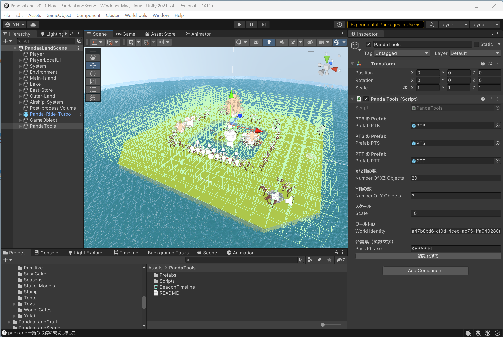
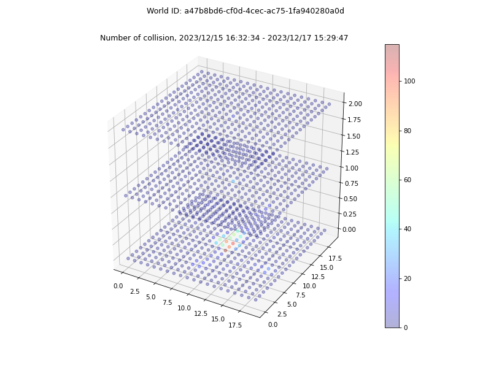

# panda-tools

バーチャル学会2023 で、こちらのポスターセッションで、

> p72-D4：「clusterワールドたちはどう伸びるか」観察結果
> https://sites.google.com/view/virtualconference2023/schedule/2nd-day/2nd-day-poster/D?authuser=0#h.i2lsrbob9w5i

「ワールド作者としては、訪問者の滞在時間とか動きのデータが知りたいよね」 

という話題が出たので、データの収集と可視化の仕組みを作ってみました。


## 例 ##
ぱんだーらんど https://cluster.mu/w/a47b8bd6-cf0d-4cec-ac75-1fa940280a0d の2日分のデータを可視化した例です。

### ワールドに設置した PandaTools コンポーネント ###
センサーになる格子状のコライダーや、滞在時間計測に使う Timeline を一括で設定できるツールです。



画面右側のインスペクターに見えている Panda Tools (Script) コンポーネントを設置し、全ての項目を設定してボタンを押すと、必要なギミックが全て設定される仕組みになっています。

設置したギミックが勝手にデータを収集してクラウドに集積するので、設置後はワールドを公開した状態で放置するだけです。
後日、必要になったときに、データを取得・可視化するプログラムを実行することで、下に例示するような結果を得ることができます。

この UnityPackage は、来年のバーチャル学会に向けた共同研究グループ（というか、知見を共有しあうための緩い集まり）のメンバー限定で共有しますので、参加を希望されるワールドクリエイター様は [けぱんだ](https://twitter.com/kepa4696) までご連絡ください。

### 各グリッドの衝突判定回数をヒートマップで可視化した例 ###


（旋回表示した動画は [こちら](resources/example-movie.mp4) です。）

### 滞在時間の傾向を可視化した例 ###


横軸（タイミング）は、各訪問者の入室からの経過秒数を、指数関数的に増加する間隔で計測点としたものです。
この図から以下のことなどが読み取れます。

- 計測期間中にワールドに訪問したのは8人で、全員が入室から112.2秒まではワールド内に滞在していた。
- 次の計測タイミング（入室から251.2秒）までのあいだに3人がワールドから離脱した。
- 入室から1258.9秒まで滞在していたのは8人中1人だった。
- その次の計測タイミング（図には無いが、入室から2818.4秒）まで滞在したケースは無かった。

### 他にもできること ###
計測グリッドの荒い解像度ではありますが、特定の訪問者に着目して、ワールド内でどのように移動したかの軌跡（グリッド座標と時刻の並び）を再現したりもできます。
（あくまで匿名の統計的利用向けのデータしか取得できませんので、アカウントを特定したりすることはできません。）

# データ分析用プログラミング環境のご利用方法 #

1. ご自身の PC に git と python と pipenv が利用できる環境を構築します。
2. https://github.com/kamicup/panda-tools をクローン（作業ディレクトリにコピー）します。
3. `pipenv shell` で作業環境に切り替えます。
4. `pipenv install` で依存ライブラリをインストールします。
5. src/analyzers ディレクトリ配下にある集計・可視化プログラムを実行します。

例えば、ぱんだーらんどのデータを取得するには、以下のようなコマンドを実行します。

```shell
# 初回のみ必要なセットアップ
pipenv shell
pipenv install
```

```shell
# 集計用プログラムの実行
python .\src\analyzers\spatial.py a47b8bd6-cf0d-4cec-ac75-1fa940280a0d_KEPAPIPI
```

コマンドの引数は `{ワールドID}_{パスフレーズ}` の形式です。
（それぞれ Unity 用 PandaTools の `World Identity` 及び `Pass Phrase` フィールドに設定した値です。）

ご用意した `spatial.py` は簡単な集計と可視化だけを行うプログラムです。
ぜひご自身でカスタマイズしたり、より良い分析ツールを作成していただければ幸いです。

（例えばロジックを参考にしていただいて Unity 用のスクリプトを書いて、集計結果を再びワールドのシーンに反映させるような反再帰的なシステムを作ったら面白いかもしれません。）


# クラウド側のシステムについて #

クラウド側（ワールドから送信されるデータを受信してデータベースに保存したりする部分）は AWS SAM (Serverless Application Model) という仕組みを利用して構築しています。
（具体的には API Gateway, Lambda, DynamoDB で構成されています。）

共同研究者であれば

もし AWS の運用に明るい方であれば、このリポジトリのソースコードを利用して、ご自身が管理する AWS アカウント内に全く同じシステムを構築することが出来ます。

ただ、あまり詳しくない場合に中途半端な知識でやってみることはおススメしません。「AWS クラウド破産」などでググると先人たちの怖い失敗談などがゴロゴロ出てきますので、しっかり専門家の指導を受けたり、いっそ専門業者に外注するなどしたほうが良いかもしれません。
（ある程度の予算を確保できる場合であれば、けぱんだがお仕事として請けることも可能ですので、もし必要があればご相談ください。）
