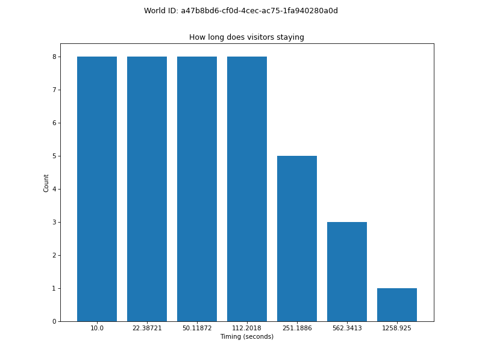

# panda-tools

バーチャル学会2023 で、こちらのポスターセッションで、

> p72-D4：「clusterワールドたちはどう伸びるか」観察結果
> https://sites.google.com/view/virtualconference2023/schedule/2nd-day/2nd-day-poster/D?authuser=0#h.i2lsrbob9w5i

「ワールド作者としては、訪問者の滞在時間とか動きのデータが知りたいよね」 

という話題が出たので、データの収集と可視化の仕組みを作ってみました。

## 例 ##
ぱんだーらんど https://cluster.mu/w/a47b8bd6-cf0d-4cec-ac75-1fa940280a0d の2日分のデータを可視化した例です。

### ワールドに設置した PandaTools コンポーネント ###
センサーになる格子状のコライダーや、滞在時間計測に使う Timeline を一括で設定できるツールです。

画面右側のインスペクターに見えている Panda Tools (Script) コンポーネントを設置し、全ての項目を設定してボタンを押すと、必要なギミックが全て設定される仕組みになっています。

設置したギミックが勝手にデータを収集してクラウドに集積するので、設置後はワールドを公開した状態で放置するだけです。
後日、必要になったときに、データを取得・可視化するプログラムを実行することで、下に例示するような結果を得ることができます。

この UnityPackage は、来年のバーチャル学会に向けた共同研究グループ（というか、知見を共有しあうための緩い集まり）のメンバー限定で共有しますので、参加を希望されるワールドクリエイター様は [けぱんだ](https://twitter.com/kepa4696) までご連絡ください。

### 各グリッドの衝突判定回数をヒートマップで可視化した例 ###

（旋回表示した動画は [こちら](resources/example-movie.mp4) です。）

### 滞在時間の傾向を可視化した例 ###

横軸（タイミング）は、各訪問者の入室からの経過秒数を、指数関数的に増加する間隔で計測点としたものです。
この図から以下のことなどが読み取れます。

- 計測期間中にワールドに訪問したのは8人で、全員が入室から112.2秒まではワールド内に滞在していた。
- 次の計測タイミング（入室から251.2秒）までのあいだに3人がワールドから離脱した。
- 入室から1258.9秒まで滞在していたのは8人中1人だった。
- その次の計測タイミング（図には無いが、入室から2818.4秒）まで滞在したケースは無かった。

### 他にもできること ###
計測グリッドの荒い解像度ではありますが、特定の訪問者に着目して、ワールド内でどのように移動したかの軌跡（グリッド座標と時刻の並び）を再現したりもできます。

